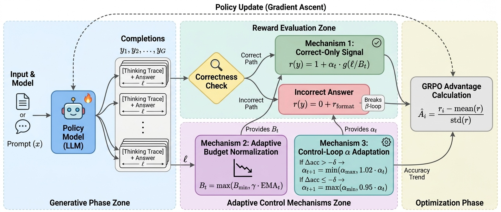

<div align="center">

# ⚖️ ACOER

### Adaptive Correct-Only Efficiency Reward

<em>Beyond Penalizing Mistakes: Stabilizing Efficiency Training in Large Reasoning Models via Adaptive Correct-Only Rewards</em>

[](https://arxiv.org/abs/2606.22716)
[](LICENSE)
[](https://arxiv.org/abs/2606.22716)
[](https://www.python.org/)
[](https://github.com/js-lee-AI/ACOER/stargazers)



<em>Length pressure on <b>correct rollouts only</b>, plus a control loop that keeps GRPO efficiency training from collapsing.</em>

<b><a href="https://arxiv.org/abs/2606.22716">📄 Paper</a> · <a href="#overview">✨ Overview</a> · <a href="#install">⚙️ Install</a> · <a href="#train">🚀 Train</a> · <a href="#results">📊 Results</a> · <a href="#citation">📌 Citation</a></b>

</div>

---

## News

- **2026-06** · Paper released on [arXiv](https://arxiv.org/abs/2606.22716), and the training code is public here.

## Overview

Training code for **ACOER**, the reward proposed in *Beyond Penalizing Mistakes: Stabilizing Efficiency Training in Large Reasoning Models via Adaptive Correct-Only Rewards.*

ACOER stabilizes GRPO efficiency training by (i) applying length pressure **only to correct rollouts**, so incorrect answers never receive a continuous length penalty (the primary collapse loop), and (ii) running a **control loop** that adapts the efficiency weight from EMA accuracy/length trends and normalizes by an **adaptive token budget**, preventing over-compression of correct answers.

This repository contains the training code only (no datasets, no baselines).

```
acoer/reward.py     ACOERReward (the proposed reward) + a format reward
train_acoer.py      minimal TRL GRPO training loop using ACOER + LoRA
```

> Paper: *Beyond Penalizing Mistakes: Stabilizing Efficiency Training in Large Reasoning Models via Adaptive Correct-Only Rewards* ([arXiv:2606.22716](https://arxiv.org/abs/2606.22716)).

## Install

```bash
pip install -r requirements.txt
```

Gated checkpoints (e.g. Qwen) need `huggingface-cli login`.

## Train

```bash
python train_acoer.py --model Qwen/Qwen3-1.7B --output_dir runs/acoer \
    --max_steps 1200 --seed 42
```

The training data (MATH + GSM8K) is pulled from the Hugging Face Hub by `build_dataset` in `train_acoer.py`; no data is bundled here. ACOER hyperparameters default to the paper values and can be overridden via flags (`--alpha_init`, `--alpha_max`, `--budget_ratio`, `--warmup_steps`, ...).

### Using the reward on its own

```python
from acoer.reward import ACOERReward

reward = ACOERReward()                 # paper defaults
# call reward.set_step(global_step) once per training step (see AcoerStepCallback)
scores = reward(completions, answer=references)
```

The reward expects completions containing a `<think>...</think>` block followed by a `\boxed{}` final answer; correctness is checked with `math_verify`.

## Results

Main results (step 1200; each cell is **accuracy (%) / mean total tokens**, with token reduction vs Base in parentheses). Because length pressure is applied only to correct rollouts and is adapted by a control loop, ACOER stays stable where length-penalty baselines collapse.

| Method | MATH-500 | MATH-Hard | AIME 2025 | OlympiadBench |
|---|---|---|---|---|
| Base | 88.8 / 5,553 | 76.4 / 7,958 | 30.0 / 13,298 | 55.3 / 9,579 |
| **ACOER (ours)** | 88.4 / **2,134** (−62%) | **78.1** / 3,509 (−56%) | **36.7** / 8,922 (−33%) | 55.3 / 5,177 (−46%) |
| GRPO-acc (accuracy-only) | 88.8 / 4,091 (−26%) | 77.6 / 6,277 (−21%) | 33.3 / 11,836 (−11%) | 56.2 / 7,982 (−17%) |

ACOER cuts thinking tokens by 33–62% while matching or improving accuracy over the base model, and improves over the accuracy-only GRPO baseline on MATH-Hard and AIME 2025. Length-penalty baselines (GRPO+LP, GRPO-LEAD, ReCUT) collapse under sustained optimization (e.g. GRPO+LP falls to 68.0% on MATH-500); the structural collapse rate is **8/8** for continuous incorrect-answer penalties vs **1/6** for correct-only / binary rewards. See the paper for the full table.

## Citation

```bibtex
@article{lee2026beyond,
  title={Beyond Penalizing Mistakes: Stabilizing Efficiency Training in Large Reasoning Models via Adaptive Correct-Only Rewards},
  author={Lee, Jungseob and Lee, Seungyoon and Hong, Seongtae and Kim, Minhyuk and Park, Chanjun and Lim, Heuiseok},
  journal={arXiv preprint arXiv:2606.22716},
  year={2026}
}
```

## License

Released under the [MIT License](LICENSE). The paper is distributed under CC BY 4.0 via arXiv.
